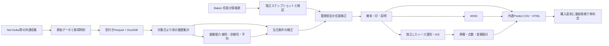

# 次期エンジンの工程設計（2026-10-11）

ユーザーの工程2〜6を改善する独立実装。収集とHTML・購入は共通化し、検証が終わるまで既存運用を使う。

図は目標構成。基礎・補正・比較CSV・現行描画関数への接続は `analysis_engine/` に実装。任意Baken補正、WIN5への接続、次期A/S・◉・買い目選別は未完成。

## 工程ごとの改良

|工程|変更する境界|今回の状態と次の作業|
|---|---|---|
|2 Baken|原始情報、票、予想家の信頼度を独立保存|2026年分のみを2026年の平地重賞へ結合する実装と予測・着順との比較表を作成。初期の3ファイルの旧形式も対応。次は発走前取得時刻、改訂履歴、過去日だけの予想家実績から限定補正へ|
|3 合体|原始情報と結果・予測を分離|原始列の明示的な許可リストとResultsのラベル境界、型、キー、欠損、時刻を持つ年別Parquetを実装。現行masterに戻し書きしない。次は日別の入力SHAと依存期間を追跡した増分更新|
|4 予測|基礎能力・当日補正・レース内比較を別々に出す|線形、HistGradientBoosting、固定平均を基礎のみ／補正ありで比較。父・母父の過去成績と条件相性を別所有にする。未来日ラベルに対する不変性を検査|
|5 WIN5|勝利確率から購入判断を行う独立消費側|既存処理を維持。候補の確率校正・競争確率の整合性とレースごとの分散を確認して接続する。重賞HybridやAuto Rとは別の目的関数|
|6 ROIとA/S|レース選別と買い目の評価、HTMLに必要な出力|`Kaime.py` は試算だけでなく日次買い目CSV・おすすめレースランクを生成し、Viewerが読み込む。撤去にはこれらの代替出力が必要。次期A/Sは時系列の購入対象選別として分離し、過去条件の平均回収率をそのまま今日の期待値と呼ばない|

## Bakenをコアの必須条件にしない

基礎モデルはNet Keiba等の共通情報だけで学習・予測する。Bakenは2026年分しかなく、収集範囲も主に重賞から全レースへ拡大してきた。2021〜2025年や未収集レースの票を埋めない。別テーブルへ保管し、2026年の重賞へドッキングして効果を分析する。重賞の補正として必要なときだけ参照し、スクレイパー失敗やサイト廃止時にも基礎予測・HTML・購入判定の出力を生成する。

将来の情報契約は `date, track, race_no, horse_no, horse_name, tipster_id, pick_role, observed_at, prestart_verified, source_sha256`。予想の票数0と収集失敗を区別する。ファイル更新時刻だけを過去レースの発走前取得証拠にしない。発走前スナップショットを追記形式で保持し、予想家の当日以降の結果を重みに入れない。

既存 `build_tipster_integration.py` の過去日参照や信頼度の考え方は参照する。一方、固定のゼロ票ペナルティ、現在の通算成績、全候補への一括乗算はそのまま移植しない。参照なし／単純な票比率／過去成績で平滑化した票の比較を同じ重賞・予算で行う。

現在の `Keiba_Sim.py` はBaken処理の失敗を通常のステップ失敗として扱うため、サイト障害がその後の実行を止める可能性がある。今回の本番コードは変更していない。次の運用接続時に、必要な出力の鮮度を守りつつ任意情報源の失敗を隔離する。

検証する候補は①サイト情報なし、②本命・お宝の票比率を重賞だけに使う、③対象日より前の予想家成績で票を平滑化する、④軸は維持して紐候補だけ補う。重賞の一律加点ではなく、軸の安定性、候補間の意見の割れ方、頭数と予算を同時に比較する。2026年の前半で仮説・重みを作り後半で比較する場合も、保存資料の取得時刻の限界を明記する。

## 血統・データ量の拡大

現在は父・母父それぞれの過去成績から開始。父×母父×競馬場×距離を一気に細分化すると大半が少標本になるため、全体→父／母父→馬場／距離帯と段階的に平滑化する。父系・母系・世代の情報を追加する場合も、能力と今回の適性を二重加点しない。

生データ、馬・血統の静的マスター、レース条件、発走前観測、結果を別テーブルにするのが次の段階。年・必要列・期間を指定してDuckDBで集計し、全CSVを毎回全列pandasへ載せる経路を避ける。特徴量は学習・予測で同じ関数を使い、取得時刻と対象日を記録する。

今回のキャッシュは内容別に保存し、古いモデルを無条件に3件へ制限しない。データスナップショットと特徴量の真の増分更新・依存範囲だけの再計算は未実装。フルCSVのハッシュ・型変換は新スナップショット作成時にまだ必要。

## 採否の手順

1. 入出力と未来情報の検査を通す。
2. 同じ時系列分割で基礎・補正・補正除去を比較し、確率・印・軸／紐の目的を分けて評価する。
3. 同じ購入対象と予算で現行のAuto R・重賞Hybridへ接続し、年別成績、大配当依存、欠損時の挙動を見る。
4. 次期の◉・A/Sを旧選別から独立評価する。探索と完全未使用期間を区別する。
5. 本番と同じ入力でしばらく並行出力し、HTML・WIN5・自動購入の互換性を検査する。
6. 採用に十分な結果が出た候補だけエンジンを切り替える。

今回のBrier改善だけで買い目・印・購入設定を採用しない。レース抽出、券種別の順位、点数、予算を含む実運用比較が必要。

実装とコマンド：[analysis_engine/README.md](../analysis_engine/README.md)。結果は `outputs/separated_engine_lab_20261011/`、短い進行記録は [AGENTS.md](../AGENTS.md)。

使用APIの一次資料：[DuckDBのASOF](https://duckdb.org/docs/current/guides/sql_features/asof_join)、[SciPyの最適化](https://docs.scipy.org/doc/scipy/reference/generated/scipy.optimize.minimize.html)、[scikit-learnのHistGradientBoosting](https://scikit-learn.org/stable/modules/generated/sklearn.ensemble.HistGradientBoostingClassifier.html)。実行時のライブラリ版はレポートに固定して記録する。
